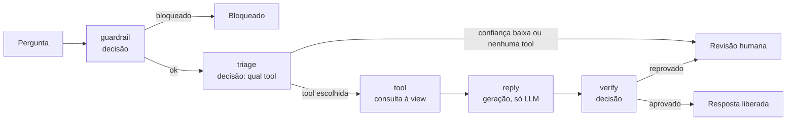

# PRD: JEV Jornada

Workshop Jornada de Dados, sábado 3 de outubro de 2026
Versão 0.5, 2 de outubro de 2026
Status: rascunho para revisão

---

## 1. Resumo

Um agente de vendas construído em LangGraph que responde perguntas sobre os dados de vendas de uma empresa fictícia. Ele escolhe uma tool que lê uma view analítica do Postgres, redige a resposta com os dados e a verifica antes de entregar. Cada node de decisão pode rodar com um LLM convencional, com o Jev, ou com os dois ao mesmo tempo. Um frontend React mostra o que aconteceu em cada etapa e, lado a lado, o que cada modelo respondeu, quanto tempo levou, quantos tokens consumiu e quanto custou, tanto para uma pergunta quanto para um lote.

O projeto serve a dois propósitos: ser o exercício prático de um workshop de 2 horas e ficar no GitHub como ferramenta reutilizável para quem quiser medir, no próprio caso, onde o Jev substitui um LLM e onde não.

**Premissa deste documento:** o caso de uso é o agente de vendas (guardrail, escolha da tool, consulta, resposta, verificação e ação). Até a versão 0.4 o caso era a triagem de tickets de suporte; a troca foi decidida em 02/10 e está detalhada nas SPECs 07 a 10, que substituem as partes de domínio das SPECs 01 a 06.

---

## 2. Problema

Quem já tem LLM em produção paga preço de geração de texto em decisões que cabem num `if`: rotear, classificar, bloquear, verificar. Essas chamadas são lentas (segundos), caras (tokens de saída) e devolvem texto que precisa de parsing. O Jev promete resolver exatamente isso, mas as evidências disponíveis são da própria TypeSafe. Ninguém na comunidade tem um jeito simples de testar a promessa com os próprios dados e o próprio fluxo.

Um teste justo exige que os dois modelos recebam a mesma entrada, respondam às mesmas perguntas, dentro do mesmo pipeline, com medição idêntica. É isso que o projeto entrega.

---

## 3. Objetivos e métricas de sucesso

| Objetivo | Como medimos |
|---|---|
| Qualquer pessoa roda o projeto em minutos | README e modo replay: pipeline rodando sem nenhuma chave em menos de 5 minutos |
| A comparação é justa e reproduzível | Mesmo `DecisionSpec` alimenta os dois providers; mesmo dataset; métricas calculadas pelo mesmo código |
| O resultado é visível sem explicação | Dashboard mostra, para cada node, latência p50/p95, tokens, custo, acurácia e taxa de concordância em uma tela |
| Trocar de modelo é um clique | Dropdown com o catálogo da seção 7.7; o mesmo lote pode ser repetido com outro modelo e comparado |

Fora dos objetivos: provar que o Jev é melhor. O projeto mede; a conclusão é de quem roda.

---

## 4. Público

- **Participantes do workshop:** devs e pessoas de dados da comunidade Jornada de Dados, Python intermediário, a maioria já chamou uma API de LLM. Nem todos terão chave do Jev (acesso antecipado) nem de LLM.
- **Apresentador:** roda o fluxo ao vivo com chaves reais e dataset completo.
- **Leitor do repositório:** quem chega depois, pelo LinkedIn ou GitHub, e quer testar no próprio caso.

---

## 5. O caso de uso: agente de vendas

Fluxo de uma pergunta sobre vendas, do recebimento à ação:



| Node | Tipo | Perguntas | Provider |
|---|---|---|---|
| `guardrail` | decisão | noul: tentativa de prompt injection? pede ou contém dado pessoal sensível? fora do escopo de vendas da empresa? | LLM, Jev ou ambos |
| `triage` | decisão | choice: qual tool responde a pergunta (uma por view, mais `nenhuma`) | LLM, Jev ou ambos |
| `tool` | determinístico | executa a tool escolhida pelo primário: `SELECT` na view do registro | código |
| `reply` | geração | resposta em português, só com os dados que a tool devolveu | somente LLM |
| `verify` | decisão | noul: a resposta é fiel aos dados?; noul: responde à pergunta?; noul: cita número que não está nos dados? | LLM, Jev ou ambos |
| `act` | determinístico | decide entre resposta liberada, revisão humana ou bloqueio, pelos limiares de confiança | código |

O node `reply` existe de propósito: é onde o LLM é insubstituível, e deixa claro que o Jev não compete com ele ali. A escolha da tool é uma decisão tipada, não tool calling nativo: é o que permite comparar Jev e LLM na mesma pergunta.

### 5.1 Os dados

Postgres 17 em Docker (`docker-compose.yml`), com a empresa fictícia Mercado Jornada: regiões, categorias, produtos, vendedores, clientes, pedidos, itens de pedido e metas, de janeiro de 2025 a setembro de 2026. O seed é gerado por script com semente fixa e versionado como SQL.

As tools leem views sem parâmetros, pequenas (até 25 linhas), sem `now()`:

| Tool | View | Conteúdo |
|---|---|---|
| `vendas_mensal` | `vw_vendas_mensal` | receita, pedidos, ticket médio e variação por mês |
| `vendas_por_categoria` | `vw_vendas_por_categoria` | receita, unidades, margem e participação por categoria em 2026 |
| `top_produtos` | `vw_top_produtos` | os 10 produtos de maior receita em 2026 |
| `vendas_por_vendedor` | `vw_vendas_por_vendedor` | receita, pedidos, meta e atingimento por vendedor em 2026 |
| `vendas_por_regiao` | `vw_vendas_por_regiao` | receita, pedidos, clientes ativos e participação por região em 2026 |
| `top_clientes` | `vw_top_clientes` | os 10 clientes de maior receita em 2026 |
| `kpis` | `vw_kpis` | indicadores gerais de 2026: receita, crescimento, pedidos, ticket médio, clientes ativos, atingimento de meta, cancelamento, margem |

O nome da view vem sempre do registro de tools no código, nunca do modelo. A aplicação conecta com um usuário que só lê as views.

---

## 6. Escopo

### Dentro (P0, obrigatório para o workshop)

1. Grafo LangGraph com os seis nodes acima e arestas condicionais por confiança.
2. Abstração `DecisionProvider` com três implementações: `JevProvider`, `LLMProvider`, `ReplayProvider`.
3. Modo "ambos": o node executa os dois providers em paralelo, registra os dois resultados e segue o fluxo com o provider marcado como primário.
4. Backend FastAPI com execução de uma pergunta e de um lote, eventos em tempo real via SSE.
5. Frontend React com três telas: configuração do grafo, playground de uma pergunta, dashboard do lote.
6. Golden set de perguntas em português com rótulos, versionado no repositório.
7. Modo replay: respostas gravadas dos modelos e resultados gravados das tools, com a latência original, para rodar sem chaves e sem banco.
8. Exportação dos resultados em CSV e JSON.
9. Postgres em Docker com tabelas, seed e views de vendas, e as tools que leem as views. Exigido só em modo live e para gravar o replay.

### Dentro (P1, se der tempo antes de sábado)

10. Tabela de preços editável na interface.
11. Curva de calibração e "taxa de automação por limiar" no dashboard.
12. Histórico de execuções persistido em SQLite.

### Fora

- Autenticação, multiusuário, deploy em nuvem.
- Fine-tuning de qualquer modelo.
- Tool calling nativo do LLM, SQL gerado pelo modelo e tools com parâmetros.
- Integração com sistemas reais de vendas (ERP, CRM).

---

## 7. Arquitetura

```
┌──────────────────────────────┐        SSE / REST        ┌──────────────────────────┐
│  Frontend (React + Vite)     │ ◄──────────────────────► │  Backend (FastAPI)       │
│  - Config do grafo           │                          │  - LangGraph runtime     │
│  - Playground (1 pergunta)   │                          │  - DecisionProvider      │
│  - Dashboard (lote)          │                          │    ├─ JevProvider        │
└──────────────────────────────┘                          │    ├─ LLMProvider        │
                                                          │    └─ ReplayProvider     │
                                                          │  - Metrics + pricing     │
                                                          │  - Runs store (JSONL)    │
                                                          └─────────┬────────────────┘
                                                                    │
                                              ┌─────────────────────┼─────────────────────┐
                                              ▼                     ▼                     ▼
                                        TypeSafe API          API do LLM           fixtures/replay/

                         Postgres (views de vendas): só em modo live e na gravação do replay
```

### 7.1 Stack

| Camada | Escolha | Motivo |
|---|---|---|
| Backend | Python 3.12, FastAPI, LangGraph, LangChain (chat models), `typesafe-sdk`, pydantic, httpx, asyncpg, uv | Padrão da comunidade; LangGraph já é o que o público usa |
| Frontend | React 18, Vite, TypeScript, Tailwind v4, recharts (gráficos), EventSource nativo | Linha do tempo das etapas com estado por node; simples de rodar |
| Dados de vendas | Postgres 17 em Docker, scripts SQL de init em `db/init/` | Um comando para subir; seed determinístico |
| Armazenamento de execuções | JSONL em `runs/` (P0); SQLite via SQLModel (P1) | Zero configuração no workshop |
| Config | `.env` com `TYPESAFE_API_KEY`, `OPENAI_API_KEY` e `ANTHROPIC_API_KEY`; `config/graph.yaml` para providers, catálogo de modelos e limiares; `config/pricing.yaml` para preços | Tudo versionável, nada hardcoded |

### 7.2 A peça central: `DecisionSpec`

Uma única definição de pergunta alimenta os dois providers. É o que torna a comparação justa.

```python
class DecisionSpec(BaseModel):
    name: str                      # "tool", "injection", "fiel_aos_dados"
    type: Literal["choice", "score", "noul"]
    instructions: str              # a pergunta, em português
    criteria: dict | list | None   # opções (choice), níveis (score), true/false (noul)

class NodeSpec(BaseModel):
    name: str                      # "triage"
    state_fields: list[str]        # quais campos do estado entram no payload
    questions: list[DecisionSpec]
```

- `JevProvider` converte o `NodeSpec` diretamente no corpo da chamada `system_one` (state + questions).
- `LLMProvider` converte o mesmo `NodeSpec` em um prompt com as mesmas instruções e critérios, mais um JSON Schema gerado por pydantic. Usa structured output quando o provedor suporta; registra falha de parsing quando não vem JSON válido. Pede também um campo `confidence` de 0 a 1 por pergunta, para a comparação com a confiança calibrada do Jev.
- Modo `native` (SPEC-12, escolhido na Configuração): o `LLMProvider` troca o texto gerado do `NodeSpec` por um system prompt escrito para a etapa (`backend/config/prompts/`), como se faz em produção. O schema de saída não muda. Serve para medir o Jev contra um LLM bem instruído.
- `ReplayProvider` lê de `fixtures/replay/<provider>/<question_id>.json` e reproduz resposta e latência gravadas.

### 7.3 Interface do provider

```python
class ProviderResult(BaseModel):
    provider: Literal["jev", "llm", "replay"]
    model: str
    answers: dict[str, Answer]     # por nome de pergunta
    latency_ms: float
    tokens_in: int
    tokens_out: int
    cost_usd: float
    parse_ok: bool                 # sempre True no Jev
    values_in_schema: bool         # False se o LLM inventou uma opção
    raw: dict                      # resposta bruta, para debug

class Answer(BaseModel):
    value: str | int | float       # choice: opção; score: índice; noul: probabilidade
    confidence: float | None       # Jev: calibrada; LLM: autorrelatada
    probabilities: dict | None     # Jev: distribuição; LLM: None

class DecisionProvider(Protocol):
    async def decide(self, node: NodeSpec, payload: dict) -> ProviderResult: ...
```

### 7.4 Modo "ambos" dentro do node

```python
async def decision_node(state, node_spec, config):
    mode = config.providers[node_spec.name]           # "llm" | "jev" | "both"
    providers = resolve(mode)                         # 1 ou 2 providers
    results = await asyncio.gather(*(p.decide(node_spec, payload(state, node_spec)) for p in providers))
    emit(provider_finished for r in results)
    primary = pick(results, config.primary)           # "jev" por padrão
    return {
        "metrics": state["metrics"] + results,
        node_spec.name: primary.answers,              # só o primário segue no fluxo
    }
```

Decisão de design: em modo "ambos", apenas o resultado do provider primário influencia as arestas condicionais. Os dois ficam registrados em `metrics`. Isso evita o grafo bifurcar e mantém o comportamento previsível.

### 7.5 Estado do grafo

```python
class SalesState(TypedDict):
    run_id: str
    question: dict                 # id e text; os rótulos do golden set nunca entram
    guardrail: dict | None
    triage: dict | None
    tool_result: dict | None       # tool, view, columns, rows, row_count, truncated, latency_ms
    draft_reply: str | None
    verify: dict | None
    action: Literal["auto", "human", "blocked"] | None
    metrics: list[ProviderResult]
```

### 7.6 Arestas condicionais (limiares em `graph.yaml`)

| Aresta | Regra padrão |
|---|---|
| `guardrail → END` | qualquer noul de risco ≥ 0,70 |
| `triage → human` | `tool.confidence` < 0,80, ou a tool escolhida é `nenhuma` |
| `tool → human` | a consulta falhou |
| `verify → human` | `fiel_aos_dados` < 0,80 ou `inventa_numero` ≥ 0,30 |

Os limiares são exemplo. O workshop mostra como escolhê-los pelo dashboard.

### 7.7 Catálogo de modelos (dropdown do LLM)

O `LLMProvider` instancia o modelo via `langchain.chat_models.init_chat_model("<provider>:<model_id>")`, com `with_structured_output` a partir do schema gerado do `NodeSpec`. O catálogo fica em `graph.yaml` e alimenta o dropdown da interface.

| Rótulo no dropdown | Provedor | `model_id` | Preço entrada / saída (US$ por 1M tokens) |
|---|---|---|---|
| GPT-6 Sol | OpenAI | `gpt-6-sol` | 2,00 / 10,00 |
| GPT-6 Luna | OpenAI | `gpt-6-luna` | 0,10 / 0,50 |
| GPT-5.6 Sol | OpenAI | `gpt-5.6-sol` | 5,00 / 30,00 |
| GPT-5.6 Terra | OpenAI | `gpt-5.6-terra` | 2,00 / 12,00 |
| GPT-5.6 Luna | OpenAI | `gpt-5.6-luna` | 0,20 / 1,20 |
| Claude Opus 5.5 | Anthropic | `claude-opus-5-5` | 4,00 / 20,00 |
| Claude Sonnet 5.5 | Anthropic | `claude-sonnet-5-5` | 2,00 / 10,00 |
| Claude Haiku 4.5 | Anthropic | `claude-haiku-4-5-20251001` | 1,00 / 5,00 |
| Jev | TypeSafe | `jev-1.13.0` | 0,042 / 0 |

Notas:
- Preços da OpenAI são os vigentes desde 30/07/2026 segundo a página de preços; conferir no dia e registrar a data em `pricing.yaml`. Os da Anthropic são os tokens base da tabela de preços em 03/10/2026; prompt caching fica fora do cálculo de custo.
- A OpenAI não lançou GPT-6 Terra; o catálogo traz GPT-6 Sol e Luna. Astra fica fora.
- Padrão do dropdown: GPT-5.6 Luna (o modelo mais próximo em custo do papel que o Jev ocupa). Sol e Opus entram como referência de qualidade.
- `reasoning_effort` fixo em `none` (OpenAI) e sem *extended thinking* (Anthropic) nos nodes de decisão, para medir o custo de uma decisão simples e manter `function calling` funcional; configurável por modelo em `graph.yaml`.

---

## 8. Requisitos funcionais

| ID | Requisito | Prioridade |
|---|---|---|
| RF-01 | Usuário escolhe, por node de decisão, entre `llm`, `jev` e `both`, e qual é o primário | P0 |
| RF-02 | Usuário escolhe o modelo de LLM num dropdown alimentado pelo catálogo da seção 7.7 (OpenAI e Anthropic), por node ou global | P0 |
| RF-03 | Usuário envia uma pergunta digitada ou seleciona uma do golden set | P0 |
| RF-04 | Backend executa o grafo e emite eventos: `run.started`, `node.started`, `provider.finished`, `tool.finished`, `node.finished`, `run.finished` | P0 |
| RF-05 | Playground mostra, por node, os cards dos providers lado a lado com respostas, confiança, latência, tokens e custo | P0 |
| RF-06 | Playground destaca discordâncias entre os dois providers | P0 |
| RF-07 | Playground mostra o caminho tomado no grafo e a ação final | P0 |
| RF-08 | Usuário dispara lote de N perguntas do golden set (N configurável) com barra de progresso | P0 |
| RF-09 | Dashboard calcula e exibe as métricas da seção 9 por node e por provider | P0 |
| RF-10 | Exportação de resultados em CSV e JSON | P0 |
| RF-11 | Modo replay funciona sem nenhuma chave de API e sem banco | P0 |
| RF-15 | As tools leem só views do registro, com usuário somente-leitura e limite de linhas | P0 |
| RF-12 | Tabela de preços editável na interface, com Jev pré-preenchido (US$ 0,042/M entrada, US$ 0 saída) | P1 |
| RF-13 | Curva de calibração e automação por limiar | P1 |
| RF-14 | Histórico de execuções com comparação entre lotes | P1 |

---

## 9. Métricas

### 9.1 Por chamada (coletadas no `ProviderResult`)

| Métrica | Como | Observação |
|---|---|---|
| `latency_ms` | relógio monotônico ao redor da chamada HTTP | mede o que o usuário sentiria |
| `tokens_in`, `tokens_out` | campo `usage` da resposta | Jev reporta tokens de saída, mas eles custam zero |
| `cost_usd` | `tokens_in × preço_in + tokens_out × preço_out`, de `pricing.yaml` | tabela da seção 7.7, com data de referência registrada no arquivo |
| `parse_ok` | JSON válido e aderente ao schema | só faz sentido para o LLM |
| `values_in_schema` | todo `choice` está entre as opções, todo `noul` em [0,1] | mede "alucinação de rótulo" |

### 9.2 Por lote (calculadas pelo `metrics/aggregator.py`)

| Métrica | Perguntas | Definição |
|---|---|---|
| Acurácia | `tool` | acerto contra o rótulo do golden set |
| F1 macro | `tool` | sensível a classes raras |
| Acurácia binária | nouls do guardrail | com limiar 0,5 |
| Brier score e ECE | todas | Jev: probabilidades; LLM: `confidence` autorrelatada (P1) |
| Taxa de concordância | todas | % de perguntas em que Jev e LLM deram a mesma resposta |
| p50 / p95 de latência | por node | |
| Custo total e custo por 1.000 perguntas | por node e total | |
| Falha de parsing | LLM | % de chamadas com `parse_ok = False` |
| Taxa de automação por limiar | `tool` | % das perguntas com confiança ≥ t e acurácia nesse subconjunto (P1) |

### 9.3 Golden set

Arquivo `data/golden_set.json`, versionado, no formato:

```json
{
  "id": "q-042",
  "text": "Qual região vendeu mais este ano?",
  "labels": { "tool": "vendas_por_regiao" },
  "guardrail": { "injection": false, "dado_sensivel": false, "fora_escopo": false },
  "tags": ["regiao"],
  "difficulty": "easy"
}
```

Decidido: 60 perguntas de vendas escritas à mão (7 por tool, mais 11 que nenhuma view responde) e 20 casos adversariais para o guardrail. Os dados são fictícios, sem dado pessoal.

---

## 10. Frontend

### Tela 1: Configuração

- Lista dos nodes de decisão com seletor `LLM | Jev | Ambos` e marcador de primário.
- Dropdown de modelo de LLM com o catálogo da seção 7.7, agrupado por provedor (OpenAI, Anthropic), mostrando preço de entrada e saída ao lado de cada opção. Global por padrão, com override por node.
- Limiares de confiança por aresta.
- (P1) Tabela de preços.

### Tela 2: Playground

- Campo da pergunta e perguntas de exemplo do golden set.
- Linha do tempo das seis etapas. Cada etapa mostra o estado (aguardando, rodando, concluída, pulada, bloqueada), um resumo de uma frase e a latência, conforme os eventos SSE.
- Detalhe sob demanda: em cada etapa de decisão, dois cards lado a lado, um por provider, com respostas, confiança, barra de probabilidades (Jev), latência, tokens, custo, badge de `parse_ok` e `values_in_schema`. Perguntas com respostas diferentes ficam destacadas. Na etapa `tool`, a tabela com os dados que a view devolveu.
- Resposta final, com a ação e, quando não é liberada, o motivo.

### Tela 3: Dashboard do lote

- Controles: N perguntas, filtro por tag, botão de executar, progresso.
- Cards de resumo: acurácia, custo total, p95, concordância, por provider.
- Gráficos: distribuição de latência (histograma por provider), custo acumulado por node, acurácia por pergunta, (P1) curva de calibração, (P1) automação por limiar.
- Tabela de perguntas com filtro "só discordâncias" e "só erros", abrindo a pergunta no playground.
- Botões de exportar CSV e JSON.

Idioma da interface: português.

---

## 11. API do backend

| Método | Rota | Função |
|---|---|---|
| GET | `/config` | configuração atual do grafo (providers, limiares, modelos) |
| PUT | `/config` | atualiza configuração |
| GET | `/pricing` / PUT `/pricing` | tabela de preços |
| GET | `/dataset?tag=&limit=` | perguntas do golden set |
| GET | `/tools` | registro de tools (nome, título, descrição, view) |
| POST | `/runs` | executa uma pergunta; retorna `run_id` |
| GET | `/runs/{run_id}/events` | SSE com os eventos da execução |
| GET | `/runs/{run_id}` | resultado completo |
| POST | `/batches` | executa um lote; retorna `batch_id` |
| GET | `/batches/{batch_id}/events` | SSE com progresso e métricas parciais |
| GET | `/batches/{batch_id}/report` | métricas agregadas |
| GET | `/batches/{batch_id}/export?format=csv\|json` | exportação |

Execução de lote com concorrência limitada (`asyncio.Semaphore`, padrão 5) para não estourar rate limit.

---

## 12. Estrutura do repositório

```
jev-jornada/
├── backend/
│   ├── app/
│   │   ├── main.py              # FastAPI, rotas, SSE
│   │   ├── graph.py             # LangGraph: nodes, arestas, estado
│   │   ├── specs.py             # NodeSpec e DecisionSpec dos 3 nodes de decisão
│   │   ├── tools.py             # registro de tools e leitura das views
│   │   ├── providers/
│   │   │   ├── base.py          # Protocol, ProviderResult, Answer
│   │   │   ├── jev.py
│   │   │   ├── llm.py
│   │   │   └── replay.py
│   │   ├── metrics/
│   │   │   ├── pricing.py
│   │   │   └── aggregator.py
│   │   └── store.py             # JSONL em runs/
│   ├── config/
│   │   ├── graph.yaml
│   │   └── pricing.yaml
│   ├── fixtures/replay/         # respostas gravadas
│   └── tests/
├── frontend/
│   └── src/
│       ├── pages/ (Config, Playground, Batch)
│       ├── components/ (PipelineTimeline, ProviderCard, DiffBadge, charts, ui)
│       └── lib/ (api.ts, sse.ts, types.ts)
├── data/
│   ├── golden_set.json
│   └── scripts/generate_sales_seed.py
├── db/init/                     # schema, seed, views e role do Postgres
├── docker-compose.yml
├── runs/                        # gitignored
├── .env.example
└── README.md
```

---

## 13. Passo 0: repositório, harness do agente e CLAUDE.md

Antes de quebrar o projeto em SPECs e implementar qualquer coisa, o repositório precisa existir com as regras de trabalho prontas. Este passo é feito uma vez, à mão, e é o que permite que o agente de código (Claude Code) e as pessoas trabalhem no mesmo padrão. Entrega: um commit `chore: passo 0, repositório e harness` em `main`, com tudo abaixo.

### 13.1 Padrão de Git

| Tema | Regra |
|---|---|
| Branching | Trunk-based. `main` sempre executável, protegida. Todo trabalho em branch curta (`feat/`, `fix/`, `chore/`, `docs/`, `data/`) que volta por pull request com squash merge |
| Commits | Conventional Commits: `tipo(escopo): descrição`. Escopos: `backend`, `frontend`, `graph`, `providers`, `data`, `config`, `docs`, `db` |
| Pull request | Template com quatro perguntas: o que muda, como testar, afeta o modo replay?, afeta métricas ou preços? |
| Tags | `step-0` a `step-5` marcando os estados do workshop, criadas após o ensaio e nunca movidas. Versão completa: `v1.0.0` |
| Segredos | `.env` no `.gitignore` desde o primeiro commit; `.env.example` com as variáveis vazias; `pre-commit` com `gitleaks`; secret scanning do GitHub ligado. Chave vazada é revogada, não reescrita |
| Versionado | `data/golden_set.json`, `fixtures/replay/`, `config/*.yaml`, `docs/specs/`, `CLAUDE.md` |
| Ignorado | `runs/`, `.venv/`, `node_modules/`, `__pycache__/`, `.env` |
| Dependências | Versões fixas em `pyproject.toml` e `package.json` (`typesafe-sdk`, `langgraph`, `langchain`, `@xyflow/react`) |
| Versão de configuração | `graph.yaml` carrega um campo `config_version`; cada resultado exportado grava essa versão para que lotes de dias diferentes sejam comparáveis |

### 13.2 CI mínima

Um workflow do GitHub Actions por pull request: `ruff` e `pytest` no backend; `eslint`, `tsc --noEmit` e `vite build` no frontend; e um job que executa o grafo em modo replay com três perguntas do golden set. Esse último job é o contrato do projeto: tem que funcionar sem nenhuma chave e sem banco.

### 13.3 Harness do agente

O harness é o conjunto de arquivos que dá contexto e limites ao Claude Code para trabalhar no repositório sem supervisão linha a linha.

```
jev-jornada/
├── CLAUDE.md                    # instruções do agente (abaixo)
├── docs/
│   ├── PRD.md                   # este documento
│   └── specs/
│       ├── README.md            # como uma SPEC é escrita e aceita
│       ├── SPEC-00-passo-0.md
│       ├── SPEC-01-providers.md
│       ├── SPEC-02-graph.md
│       ├── SPEC-03-api-sse.md
│       ├── SPEC-04-frontend-config-playground.md
│       ├── SPEC-05-batch-dashboard.md
│       └── SPEC-06-golden-set-replay.md
├── .claude/
│   └── settings.json            # comandos permitidos (uv, npm, pytest, ruff, git sem push forçado)
├── .github/
│   ├── PULL_REQUEST_TEMPLATE.md
│   └── workflows/ci.yml
├── .pre-commit-config.yaml
├── .env.example
└── .gitignore
```

Cada SPEC tem o mesmo formato: objetivo em uma frase, seções do PRD que cobre, interfaces que expõe (assinaturas, rotas, schemas), critérios de aceite verificáveis por teste, e o que fica fora. Uma SPEC vira uma ou mais branches; um PR referencia a SPEC no título. O agente só implementa a partir de uma SPEC aceita, nunca a partir do PRD direto.

### 13.4 Conteúdo do CLAUDE.md

Curto, factual, atualizado a cada SPEC concluída. Seções:

1. **O que é o projeto**, em três linhas, com link para `docs/PRD.md` e `docs/specs/`.
2. **Como rodar**: `uv sync`, `uv run uvicorn app.main:app --reload`, `npm install`, `npm run dev`, `PROVIDER_MODE=replay` como padrão de desenvolvimento. Rodar com chaves reais só quando a tarefa pedir.
3. **Como testar**: `uv run pytest`, `npm run test`, e o comando do replay de três perguntas. Toda SPEC concluída tem teste; PR sem teste não entra.
4. **Convenções**: Conventional Commits, branch por SPEC, squash merge, nunca commit em `main`, nunca `git push --force`, nunca mover tags.
5. **Regras do domínio**: o mesmo `NodeSpec` alimenta os dois providers (não criar prompts separados por provider); em modo `both` só o primário segue no fluxo; `reply` é só LLM; preços vêm de `pricing.yaml`, nunca hardcoded; tokens e latência vêm da resposta e do relógio monotônico, nunca estimados.
6. **O que não tocar sem pedir**: `data/golden_set.json`, `fixtures/replay/`, `config/pricing.yaml`, limiares em `graph.yaml`. Mudanças nesses arquivos alteram o resultado da comparação e precisam de commit `data:` ou `config:` explícito e revisão humana.
7. **Segredos**: nunca ler, imprimir ou commitar valores do `.env`; se encontrar uma chave em código, parar e avisar.
8. **Definição de pronto**: lint limpo, testes passando, CI verde, modo replay funcionando, `CLAUDE.md` e a SPEC atualizados se as interfaces mudaram.

### 13.5 Checklist de saída do passo 0

- [ ] Repositório `jev-jornada` criado, `main` protegida, squash merge como padrão
- [ ] `.gitignore`, `.env.example`, `pre-commit` com `gitleaks`, secret scanning ligado
- [ ] `PULL_REQUEST_TEMPLATE.md` e `ci.yml` commitados e CI verde num PR vazio
- [ ] `CLAUDE.md` escrito e `.claude/settings.json` com os comandos permitidos
- [ ] `docs/PRD.md` e `docs/specs/README.md` no repositório; as seis SPECs criadas, ainda que só com objetivo e critérios de aceite
- [ ] Scaffold mínimo: `backend/` com FastAPI respondendo `/health`, `frontend/` com Vite abrindo uma página vazia, ambos rodando com um comando cada

Só depois deste checklist as SPECs são detalhadas e a implementação começa, uma SPEC por vez, na ordem 06 (golden set e replay, porque tudo depende dele), 01, 02, 03, 04, 05.

---

## 14. Riscos

| Risco | Impacto | Mitigação |
|---|---|---|
| Participante sem Docker | Não sobe o Postgres | Replay usa resultados gravados das tools; o banco só é exigido em modo live |
| Seed ou views mudam depois da gravação | Fixtures citam números que não existem mais | `db/init/` é arquivo protegido; teste de reprodutibilidade do seed |
| Participantes sem chave do Jev, da OpenAI ou da Anthropic | Não conseguem rodar o real | Modo replay com respostas gravadas pelo apresentador, que tem as três chaves no `.env` |
| Wi-Fi do evento ou rate limit da API | Demo ao vivo trava | Replay como fallback com um toggle; lote ao vivo limitado a 100 perguntas; concorrência 5 |
| Custo do LLM no lote | Surpresa na fatura | Estimativa exibida antes de rodar; limite de N no backend |
| Não determinismo dos modelos | Números mudam entre execuções | Mostrar isso como feature: rodar duas vezes e ver a variação; replay é determinístico |
| Preços dos modelos mudam | Custo errado | `pricing.yaml` com data e fonte; conferir OpenAI e Anthropic na véspera |
| LGPD / dados reais | Vazamento | Golden set sintético; dados reais só como extensão opcional e anonimizada |
| `typesafe-sdk` ou API mudam até sábado | Código quebra | Fixar versão do SDK no `pyproject`; replay continua funcionando de qualquer forma |

---

## 15. Decisões

| Tema | Decisão |
|---|---|
| Nome do projeto | JEV Jornada (repositório `jev-jornada`) |
| Modelo de decisão | Jev (`jev-1.13.0`), com `TYPESAFE_API_KEY` no `.env` |
| LLMs da comparação | Dropdown com o catálogo da seção 7.7: GPT-6 Sol e Luna, GPT-5.6 Sol, Terra e Luna, Claude Opus 5.5, Sonnet 5.5 e Haiku 4.5. Chaves `OPENAI_API_KEY` e `ANTHROPIC_API_KEY` no `.env`. Sem GPT-6 Astra |
| Quem roda o modo real | O apresentador. Quem não tiver chaves usa o modo replay |
| Caso de uso | Agente de vendas sobre views do Postgres; substitui a triagem de tickets (02/10) |
| Escolha da tool | Decisão tipada (`choice`), comparável entre Jev e LLM; sem tool calling nativo |
| Views | Sem parâmetros; um resultado gravado por tool serve o replay de qualquer pergunta |
| Golden set | 60 perguntas de vendas mais 20 adversariais. Dados fictícios |
| Fluxo no frontend | Linha do tempo das etapas, atualizada pelos eventos SSE; sem `@xyflow/react` |
| Licença | O repositório não usa licença MIT. Nenhum arquivo de licença por enquanto |

Não há decisões em aberto nesta versão.

---

## 16. Glossário

- **Jev:** modelo da TypeSafe AI que devolve decisões tipadas com probabilidade calibrada, sem gerar texto.
- **System One Model:** categoria criada pela TypeSafe para esse tipo de modelo.
- **RLCD:** Reinforcement Learning for Calibrated Decisions, método de treino do Jev.
- **choice / score / noul:** os três tipos de pergunta do Jev: escolha entre opções, nota numa rubrica, probabilidade de uma afirmação ser verdadeira.
- **Provider primário:** em modo "ambos", o provider cuja resposta segue no fluxo do grafo.
- **Replay:** execução a partir de respostas gravadas, sem chamar APIs.
- **Golden set:** conjunto de perguntas rotuladas que serve de ground truth.
- **Tool:** leitura de uma view analítica do Postgres, escolhida pela triagem.
