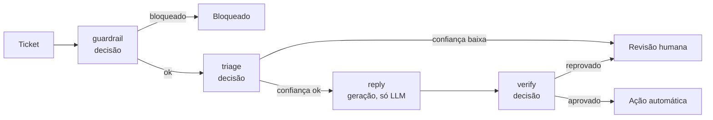

# PRD: JEV Jornada

Workshop Jornada de Dados, sábado 3 de outubro de 2026
Versão 0.3, 1 de outubro de 2026
Status: rascunho para revisão

---

## 1. Resumo

Um pipeline de triagem de tickets de suporte construído em LangGraph, onde cada node de decisão pode rodar com um LLM convencional, com o Jev, ou com os dois ao mesmo tempo. Um frontend React mostra, lado a lado, o que cada modelo respondeu, quanto tempo levou, quantos tokens consumiu e quanto custou, tanto para um ticket quanto para um lote de centenas.

O projeto serve a dois propósitos: ser o exercício prático de um workshop de 2 horas e ficar no GitHub como ferramenta reutilizável para quem quiser medir, no próprio caso, onde o Jev substitui um LLM e onde não.

**Premissa deste documento:** o caso de uso é a triagem de tickets de suporte (fila, urgência, pedido de reembolso, risco de cancelamento), com guardrail na entrada e verificação da resposta na saída, conforme definido na live de 29/09. Se o caso mudar, as seções 5, 8 e 11 precisam ser revistas.

---

## 2. Problema

Quem já tem LLM em produção paga preço de geração de texto em decisões que cabem num `if`: rotear, classificar, bloquear, verificar. Essas chamadas são lentas (segundos), caras (tokens de saída) e devolvem texto que precisa de parsing. O Jev promete resolver exatamente isso, mas as evidências disponíveis são da própria TypeSafe. Ninguém na comunidade tem um jeito simples de testar a promessa com os próprios dados e o próprio fluxo.

Um teste justo exige que os dois modelos recebam a mesma entrada, respondam às mesmas perguntas, dentro do mesmo pipeline, com medição idêntica. É isso que o projeto entrega.

---

## 3. Objetivos e métricas de sucesso

| Objetivo | Como medimos |
|---|---|
| Qualquer pessoa roda o projeto em minutos | README e modo replay: pipeline rodando sem nenhuma chave em menos de 5 minutos |
| A comparação é justa e reproduzível | Mesmo `DecisionSpec` alimenta os dois providers; mesmo dataset; métricas calculadas pelo mesmo código |
| O resultado é visível sem explicação | Dashboard mostra, para cada node, latência p50/p95, tokens, custo, acurácia e taxa de concordância em uma tela |
| Trocar de modelo é um clique | Dropdown com o catálogo da seção 7.7; o mesmo lote pode ser repetido com outro modelo e comparado |

Fora dos objetivos: provar que o Jev é melhor. O projeto mede; a conclusão é de quem roda.

---

## 4. Público

- **Participantes do workshop:** devs e pessoas de dados da comunidade Jornada de Dados, Python intermediário, a maioria já chamou uma API de LLM. Nem todos terão chave do Jev (acesso antecipado) nem de LLM.
- **Apresentador:** roda o fluxo ao vivo com chaves reais e dataset completo.
- **Leitor do repositório:** quem chega depois, pelo LinkedIn ou GitHub, e quer testar no próprio caso.

---

## 5. O caso de uso: triagem de tickets

Fluxo de um ticket de suporte, do recebimento à ação:



| Node | Tipo | Perguntas | Provider |
|---|---|---|---|
| `guardrail` | decisão | noul: tentativa de prompt injection? contém dado pessoal sensível? fora do escopo do suporte? | LLM, Jev ou ambos |
| `triage` | decisão | choice: fila (financeiro, pedidos, conta, outro); score: urgência (pode esperar, esta semana, hoje); noul: pede reembolso?; noul: ameaça cancelar? | LLM, Jev ou ambos |
| `reply` | geração | rascunho de resposta ao cliente, com base na triagem e na política | somente LLM |
| `verify` | decisão | noul: a resposta segue a política de reembolso?; noul: responde ao que o cliente pediu?; noul: promete algo que a política não cobre? | LLM, Jev ou ambos |
| `act` | determinístico | decide entre ação automática, revisão humana ou escalada, pelos limiares de confiança | código |

O node `reply` existe de propósito: é onde o LLM é insubstituível, e deixa claro que o Jev não compete com ele ali.

---

## 6. Escopo

### Dentro (P0, obrigatório para o workshop)

1. Grafo LangGraph com os cinco nodes acima e arestas condicionais por confiança.
2. Abstração `DecisionProvider` com três implementações: `JevProvider`, `LLMProvider`, `ReplayProvider`.
3. Modo "ambos": o node executa os dois providers em paralelo, registra os dois resultados e segue o fluxo com o provider marcado como primário.
4. Backend FastAPI com execução de um ticket e de um lote, eventos em tempo real via SSE.
5. Frontend React com três telas: configuração do grafo, playground de um ticket, dashboard do lote.
6. Golden set de tickets em português com rótulos, versionado no repositório.
7. Modo replay: respostas gravadas de execuções reais, com a latência original, para rodar sem chaves.
8. Exportação dos resultados em CSV e JSON.

### Dentro (P1, se der tempo antes de sábado)

9. Tabela de preços editável na interface.
10. Curva de calibração e "taxa de automação por limiar" no dashboard.
11. Histórico de execuções persistido em SQLite.

### Fora

- Autenticação, multiusuário, deploy em nuvem.
- Fine-tuning de qualquer modelo.
- Integração com sistemas reais de tickets (Zendesk, Freshdesk).
- Suporte a outros casos de uso além de triagem (a abstração permite, mas não entra no workshop).

---

## 7. Arquitetura

```
┌──────────────────────────────┐        SSE / REST        ┌──────────────────────────┐
│  Frontend (React + Vite)     │ ◄──────────────────────► │  Backend (FastAPI)       │
│  - Config do grafo           │                          │  - LangGraph runtime     │
│  - Playground (1 ticket)     │                          │  - DecisionProvider      │
│  - Dashboard (lote)          │                          │    ├─ JevProvider        │
└──────────────────────────────┘                          │    ├─ LLMProvider        │
                                                          │    └─ ReplayProvider     │
                                                          │  - Metrics + pricing     │
                                                          │  - Runs store (JSONL)    │
                                                          └─────────┬────────────────┘
                                                                    │
                                              ┌─────────────────────┼─────────────────────┐
                                              ▼                     ▼                     ▼
                                        TypeSafe API          API do LLM           fixtures/replay/
```

### 7.1 Stack

| Camada | Escolha | Motivo |
|---|---|---|
| Backend | Python 3.12, FastAPI, LangGraph, LangChain (chat models), `typesafe-sdk`, pydantic, httpx, uv | Padrão da comunidade; LangGraph já é o que o público usa |
| Frontend | React 18, Vite, TypeScript, Tailwind, `@xyflow/react` (grafo), recharts (gráficos), EventSource nativo | Grafo visual do fluxo com estado por node; simples de rodar |
| Armazenamento | JSONL em `runs/` (P0); SQLite via SQLModel (P1) | Zero configuração no workshop |
| Config | `.env` com `TYPESAFE_API_KEY`, `OPENAI_API_KEY` e `ANTHROPIC_API_KEY`; `config/graph.yaml` para providers, catálogo de modelos e limiares; `config/pricing.yaml` para preços | Tudo versionável, nada hardcoded |

### 7.2 A peça central: `DecisionSpec`

Uma única definição de pergunta alimenta os dois providers. É o que torna a comparação justa.

```python
class DecisionSpec(BaseModel):
    name: str                      # "fila", "urgencia", "pede_reembolso"
    type: Literal["choice", "score", "noul"]
    instructions: str              # a pergunta, em português
    criteria: dict | list | None   # opções (choice), níveis (score), true/false (noul)

class NodeSpec(BaseModel):
    name: str                      # "triage"
    state_fields: list[str]        # quais campos do estado entram no payload
    questions: list[DecisionSpec]
```

- `JevProvider` converte o `NodeSpec` diretamente no corpo da chamada `system_one` (state + questions).
- `LLMProvider` converte o mesmo `NodeSpec` em um prompt com as mesmas instruções e critérios, mais um JSON Schema gerado por pydantic. Usa structured output quando o provedor suporta; registra falha de parsing quando não vem JSON válido. Pede também um campo `confidence` de 0 a 1 por pergunta, para a comparação com a confiança calibrada do Jev.
- `ReplayProvider` lê de `fixtures/replay/<provider>/<ticket_id>.json` e reproduz resposta e latência gravadas.

### 7.3 Interface do provider

```python
class ProviderResult(BaseModel):
    provider: Literal["jev", "llm", "replay"]
    model: str
    answers: dict[str, Answer]     # por nome de pergunta
    latency_ms: float
    tokens_in: int
    tokens_out: int
    cost_usd: float
    parse_ok: bool                 # sempre True no Jev
    values_in_schema: bool         # False se o LLM inventou uma opção
    raw: dict                      # resposta bruta, para debug

class Answer(BaseModel):
    value: str | int | float       # choice: opção; score: índice; noul: probabilidade
    confidence: float | None       # Jev: calibrada; LLM: autorrelatada
    probabilities: dict | None     # Jev: distribuição; LLM: None

class DecisionProvider(Protocol):
    async def decide(self, node: NodeSpec, payload: dict) -> ProviderResult: ...
```

### 7.4 Modo "ambos" dentro do node

```python
async def decision_node(state, node_spec, config):
    mode = config.providers[node_spec.name]           # "llm" | "jev" | "both"
    providers = resolve(mode)                         # 1 ou 2 providers
    results = await asyncio.gather(*(p.decide(node_spec, payload(state, node_spec)) for p in providers))
    emit(provider_finished for r in results)
    primary = pick(results, config.primary)           # "jev" por padrão
    return {
        "metrics": state["metrics"] + results,
        node_spec.name: primary.answers,              # só o primário segue no fluxo
    }
```

Decisão de design: em modo "ambos", apenas o resultado do provider primário influencia as arestas condicionais. Os dois ficam registrados em `metrics`. Isso evita o grafo bifurcar e mantém o comportamento previsível.

### 7.5 Estado do grafo

```python
class TriageState(TypedDict):
    run_id: str
    ticket: Ticket                 # id, texto, cliente, canal, metadados
    policy: str                    # política de reembolso, entra no payload de triage e verify
    guardrail: dict | None
    triage: dict | None
    draft_reply: str | None
    verify: dict | None
    action: Literal["auto", "human", "blocked"] | None
    metrics: list[ProviderResult]
```

### 7.6 Arestas condicionais (limiares em `graph.yaml`)

| Aresta | Regra padrão |
|---|---|
| `guardrail → END` | qualquer noul de risco ≥ 0,70 |
| `triage → human` | `fila.confidence` < 0,80 |
| `verify → human` | `segue_politica` < 0,80 ou `promete_fora` ≥ 0,30 |

Os limiares são exemplo. O workshop mostra como escolhê-los pelo dashboard.

### 7.7 Catálogo de modelos (dropdown do LLM)

O `LLMProvider` instancia o modelo via `langchain.chat_models.init_chat_model("<provider>:<model_id>")`, com `with_structured_output` a partir do schema gerado do `NodeSpec`. O catálogo fica em `graph.yaml` e alimenta o dropdown da interface.

| Rótulo no dropdown | Provedor | `model_id` | Preço entrada / saída (US$ por 1M tokens) |
|---|---|---|---|
| GPT-6 Sol | OpenAI | `gpt-6-sol` | 2,00 / 10,00 |
| GPT-6 Luna | OpenAI | `gpt-6-luna` | 0,10 / 0,50 |
| GPT-5.6 Sol | OpenAI | `gpt-5.6-sol` | 5,00 / 30,00 |
| GPT-5.6 Terra | OpenAI | `gpt-5.6-terra` | 2,00 / 12,00 |
| GPT-5.6 Luna | OpenAI | `gpt-5.6-luna` | 0,20 / 1,20 |
| Claude Opus 5.5 | Anthropic | `claude-opus-5-5` | preencher em `pricing.yaml` |
| Claude Sonnet 5.5 | Anthropic | `claude-sonnet-5-5` | preencher em `pricing.yaml` |
| Claude Haiku 4.5 | Anthropic | `claude-haiku-4-5-20251001` | preencher em `pricing.yaml` |
| Jev | TypeSafe | `jev-1.13.0` | 0,042 / 0 |

Notas:
- Preços da OpenAI são os vigentes desde 30/07/2026 segundo a página de preços; conferir no dia e registrar a data em `pricing.yaml`. Os da Anthropic ficam para preenchimento na véspera.
- A OpenAI não lançou GPT-6 Terra; o catálogo traz GPT-6 Sol e Luna. Astra fica fora.
- Padrão do dropdown: GPT-5.6 Luna (o modelo mais próximo em custo do papel que o Jev ocupa). Sol e Opus entram como referência de qualidade.
- `reasoning_effort` fixo em `none` (OpenAI) e sem *extended thinking* (Anthropic) nos nodes de decisão, para medir o custo de uma decisão simples e manter `function calling` funcional; configurável por modelo em `graph.yaml`.

---

## 8. Requisitos funcionais

| ID | Requisito | Prioridade |
|---|---|---|
| RF-01 | Usuário escolhe, por node de decisão, entre `llm`, `jev` e `both`, e qual é o primário | P0 |
| RF-02 | Usuário escolhe o modelo de LLM num dropdown alimentado pelo catálogo da seção 7.7 (OpenAI e Anthropic), por node ou global | P0 |
| RF-03 | Usuário envia um ticket digitado ou seleciona um do golden set | P0 |
| RF-04 | Backend executa o grafo e emite eventos: `run.started`, `node.started`, `provider.finished`, `node.finished`, `run.finished` | P0 |
| RF-05 | Playground mostra, por node, os cards dos providers lado a lado com respostas, confiança, latência, tokens e custo | P0 |
| RF-06 | Playground destaca discordâncias entre os dois providers | P0 |
| RF-07 | Playground mostra o caminho tomado no grafo e a ação final | P0 |
| RF-08 | Usuário dispara lote de N tickets do golden set (N configurável, padrão 100) com barra de progresso | P0 |
| RF-09 | Dashboard calcula e exibe as métricas da seção 9 por node e por provider | P0 |
| RF-10 | Exportação de resultados em CSV e JSON | P0 |
| RF-11 | Modo replay funciona sem nenhuma chave de API | P0 |
| RF-12 | Tabela de preços editável na interface, com Jev pré-preenchido (US$ 0,042/M entrada, US$ 0 saída) | P1 |
| RF-13 | Curva de calibração e automação por limiar | P1 |
| RF-14 | Histórico de execuções com comparação entre lotes | P1 |

---

## 9. Métricas

### 9.1 Por chamada (coletadas no `ProviderResult`)

| Métrica | Como | Observação |
|---|---|---|
| `latency_ms` | relógio monotônico ao redor da chamada HTTP | mede o que o usuário sentiria |
| `tokens_in`, `tokens_out` | campo `usage` da resposta | Jev reporta tokens de saída, mas eles custam zero |
| `cost_usd` | `tokens_in × preço_in + tokens_out × preço_out`, de `pricing.yaml` | tabela da seção 7.7, com data de referência registrada no arquivo |
| `parse_ok` | JSON válido e aderente ao schema | só faz sentido para o LLM |
| `values_in_schema` | todo `choice` está entre as opções, todo `noul` em [0,1] | mede "alucinação de rótulo" |

### 9.2 Por lote (calculadas pelo `metrics/aggregator.py`)

| Métrica | Perguntas | Definição |
|---|---|---|
| Acurácia | `fila`, `urgencia` | acerto contra o rótulo do golden set |
| F1 macro | `fila` | sensível a classes raras |
| Erro absoluto médio | `urgencia` | distância entre nível previsto e rotulado |
| Acurácia binária | nouls | com limiar 0,5 |
| Brier score e ECE | todas | Jev: probabilidades; LLM: `confidence` autorrelatada. É o gráfico que mostra o que "calibrado" significa |
| Taxa de concordância | todas | % de tickets em que Jev e LLM deram a mesma resposta |
| p50 / p95 de latência | por node | |
| Custo total e custo por 1.000 tickets | por node e total | |
| Falha de parsing | LLM | % de chamadas com `parse_ok = False` |
| Taxa de automação por limiar | `fila` | para cada limiar t: % dos tickets com confiança ≥ t e acurácia dentro desse subconjunto. Responde "com limiar 0,85, automatizo quanto, com que precisão?" |

### 9.3 Golden set

Arquivo `data/golden_set.json`, versionado, no formato:

```json
{
  "id": "tk-0042",
  "text": "Fui cobrado duas vezes no pedido A-104 e ninguém responde há 3 dias. Quero o reembolso hoje ou cancelo.",
  "labels": { "fila": "financeiro", "urgencia": 2, "pede_reembolso": true, "risco_churn": true },
  "guardrail": { "injection": false, "dado_sensivel": false, "fora_escopo": false },
  "tags": ["cobranca-duplicada", "churn"],
  "difficulty": "medium"
}
```

Decidido: 300 tickets sintéticos em português, gerados por LLM a partir de uma taxonomia de 25 situações e revisados manualmente, mais 30 casos adversariais para o guardrail (injection, CPF e cartão no texto, pedidos fora de escopo). Sintético evita LGPD e dá ground truth limpo. Sem dados reais nesta versão.

---

## 10. Frontend

### Tela 1: Configuração

- Lista dos nodes de decisão com seletor `LLM | Jev | Ambos` e marcador de primário.
- Dropdown de modelo de LLM com o catálogo da seção 7.7, agrupado por provedor (OpenAI, Anthropic), mostrando preço de entrada e saída ao lado de cada opção. Global por padrão, com override por node.
- Limiares de confiança por aresta.
- (P1) Tabela de preços.

### Tela 2: Playground

- Área de texto do ticket e seletor do golden set.
- Grafo do fluxo renderizado com `@xyflow/react`, com os cinco nodes e as arestas condicionais. Cada node muda de cor conforme os eventos SSE (aguardando, rodando, concluído, pulado, bloqueado) e a aresta tomada fica destacada. Clicar num node abre os cards dos providers abaixo.
- Para cada node de decisão: dois cards lado a lado, um por provider. Cada card: respostas por pergunta, confiança, barra de probabilidades (Jev), latência, tokens, custo, badge de `parse_ok` e `values_in_schema`. Perguntas com respostas diferentes ficam destacadas.
- Rascunho de resposta do `reply`, resultado do `verify`, ação final e o caminho tomado.

### Tela 3: Dashboard do lote

- Controles: N tickets, filtro por tag, botão de executar, progresso.
- Cards de resumo: acurácia, custo total, p95, concordância, por provider.
- Gráficos: distribuição de latência (histograma por provider), custo acumulado por node, acurácia por pergunta, (P1) curva de calibração, (P1) automação por limiar.
- Tabela de tickets com filtro "só discordâncias" e "só erros", abrindo o ticket no playground.
- Botões de exportar CSV e JSON.

Idioma da interface: português.

---

## 11. API do backend

| Método | Rota | Função |
|---|---|---|
| GET | `/config` | configuração atual do grafo (providers, limiares, modelos) |
| PUT | `/config` | atualiza configuração |
| GET | `/pricing` / PUT `/pricing` | tabela de preços |
| GET | `/dataset?tag=&limit=` | tickets do golden set |
| POST | `/runs` | executa um ticket; retorna `run_id` |
| GET | `/runs/{run_id}/events` | SSE com os eventos da execução |
| GET | `/runs/{run_id}` | resultado completo |
| POST | `/batches` | executa um lote; retorna `batch_id` |
| GET | `/batches/{batch_id}/events` | SSE com progresso e métricas parciais |
| GET | `/batches/{batch_id}/report` | métricas agregadas |
| GET | `/batches/{batch_id}/export?format=csv\|json` | exportação |

Execução de lote com concorrência limitada (`asyncio.Semaphore`, padrão 5) para não estourar rate limit.

---

## 12. Estrutura do repositório

```
jev-jornada/
├── backend/
│   ├── app/
│   │   ├── main.py              # FastAPI, rotas, SSE
│   │   ├── graph.py             # LangGraph: nodes, arestas, estado
│   │   ├── specs.py             # NodeSpec e DecisionSpec dos 3 nodes de decisão
│   │   ├── providers/
│   │   │   ├── base.py          # Protocol, ProviderResult, Answer
│   │   │   ├── jev.py
│   │   │   ├── llm.py
│   │   │   └── replay.py
│   │   ├── metrics/
│   │   │   ├── pricing.py
│   │   │   └── aggregator.py
│   │   └── store.py             # JSONL em runs/
│   ├── config/
│   │   ├── graph.yaml
│   │   └── pricing.yaml
│   ├── fixtures/replay/         # respostas gravadas
│   └── tests/
├── frontend/
│   └── src/
│       ├── pages/ (Config, Playground, Batch)
│       ├── components/ (FlowGraph, ProviderCard, DiffBadge, charts)
│       └── lib/ (api.ts, sse.ts, types.ts)
├── data/
│   ├── golden_set.json
│   ├── policy.md                # política de reembolso usada no payload
│   └── scripts/generate_golden_set.py
├── runs/                        # gitignored
├── .env.example
└── README.md
```

---

## 13. Riscos

| Risco | Impacto | Mitigação |
|---|---|---|
| Participantes sem chave do Jev, da OpenAI ou da Anthropic | Não conseguem rodar o real | Modo replay com respostas gravadas pelo apresentador, que tem as três chaves no `.env` |
| Wi-Fi do evento ou rate limit da API | Demo ao vivo trava | Replay como fallback com um toggle; lote ao vivo limitado a 100 tickets; concorrência 5 |
| Custo do LLM no lote | Surpresa na fatura | Estimativa exibida antes de rodar; limite de N no backend |
| Não determinismo dos modelos | Números mudam entre execuções | Mostrar isso como feature: rodar duas vezes e ver a variação; replay é determinístico |
| Preços dos modelos mudam | Custo errado | `pricing.yaml` com data e fonte; conferir OpenAI e Anthropic na véspera |
| LGPD / dados reais | Vazamento | Golden set sintético; dados reais só como extensão opcional e anonimizada |
| `typesafe-sdk` ou API mudam até sábado | Código quebra | Fixar versão do SDK no `pyproject`; replay continua funcionando de qualquer forma |

---

## 14. Decisões

| Tema | Decisão |
|---|---|
| Nome do projeto | JEV Jornada (repositório `jev-jornada`) |
| Modelo de decisão | Jev (`jev-1.13.0`), com `TYPESAFE_API_KEY` no `.env` |
| LLMs da comparação | Dropdown com o catálogo da seção 7.7: GPT-6 Sol e Luna, GPT-5.6 Sol, Terra e Luna, Claude Opus 5.5, Sonnet 5.5 e Haiku 4.5. Chaves `OPENAI_API_KEY` e `ANTHROPIC_API_KEY` no `.env`. Sem GPT-6 Astra |
| Quem roda o modo real | O apresentador. Quem não tiver chaves usa o modo replay |
| Golden set | 300 tickets sintéticos mais 30 adversariais. Sem dados reais nesta versão |
| Grafo no frontend | `@xyflow/react`, com estado por node atualizado pelos eventos SSE |
| Licença | O repositório não usa licença MIT. Nenhum arquivo de licença por enquanto |

Não há decisões em aberto nesta versão.

---

## 15. Glossário

- **Jev:** modelo da TypeSafe AI que devolve decisões tipadas com probabilidade calibrada, sem gerar texto.
- **System One Model:** categoria criada pela TypeSafe para esse tipo de modelo.
- **RLCD:** Reinforcement Learning for Calibrated Decisions, método de treino do Jev.
- **choice / score / noul:** os três tipos de pergunta do Jev: escolha entre opções, nota numa rubrica, probabilidade de uma afirmação ser verdadeira.
- **Provider primário:** em modo "ambos", o provider cuja resposta segue no fluxo do grafo.
- **Replay:** execução a partir de respostas gravadas, sem chamar APIs.
- **Golden set:** conjunto de tickets rotulados que serve de ground truth.